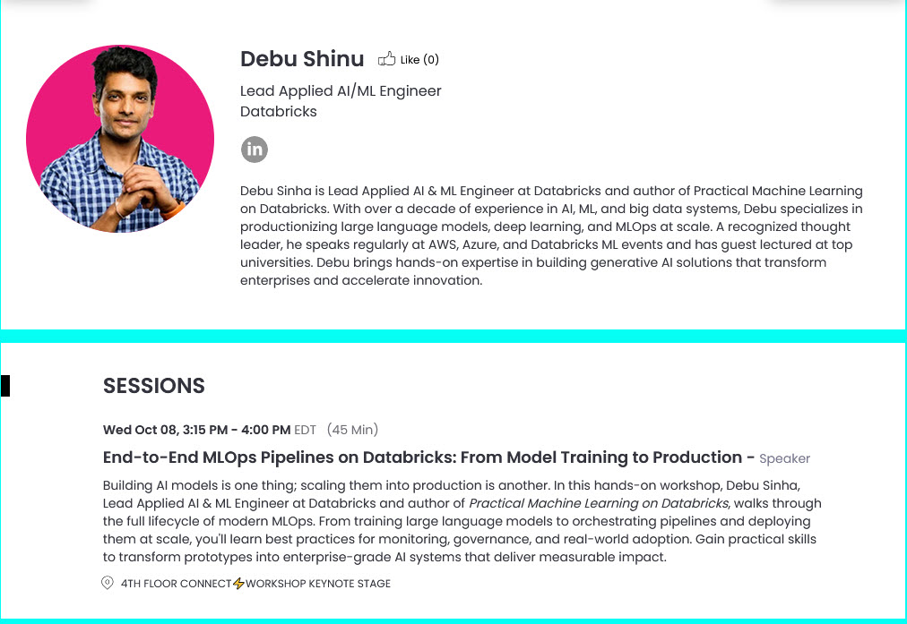
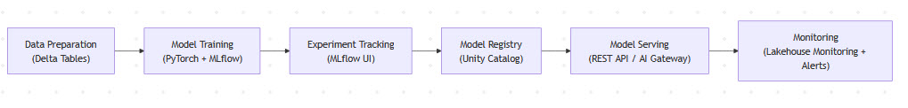
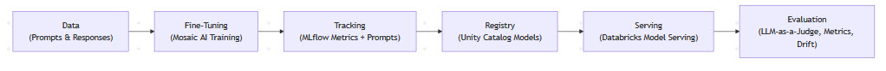

# 🚀 TechFutures 2025 — End-to-End MLOps on Databricks

<p align="center">
  
  
</p>


Welcome to the **TechFutures 2025** hands-on workshop:  
**“End-to-End MLOps Pipelines on Databricks: From Model Training to Production.”**

Led by **Debu Sinha — Lead Applied AI/ML Engineer at Databricks** and author of  
*Practical Machine Learning on Databricks*.

---

## 🧠 Workshop Overview

In this workshop, you’ll learn how to build and scale a **complete MLOps lifecycle** on Databricks:
- Train and track models using **PyTorch + MLflow**
- Register and govern models with **Unity Catalog**
- Deploy and serve models using **Model Serving / AI Gateway**
- Automate experiments with **Optuna and MLflow nested runs**
- Extend the same workflow to **LLMs via Mosaic AI**

---

## 📚 Notebook Index

| # | Notebook | Description |
|:--:|:----------|:-------------|
| **1** | [`01_MLOps_Pipeline_on_Databricks.py`](./01_MLOps_Pipeline_on_Databricks.py) | Hands-on notebook showing an end-to-end pipeline — train, track, register and deploy a PyTorch model with MLflow. |
| **2** | [`02_Advanced_MLflow_PyTorch_Tutorial.py`](./02_Advanced_MLflow_PyTorch_Tutorial.py) | Advanced workflow covering Optuna tuning, Unity Catalog governance, and Spark batch inference. |
| *(Optional)* **3** | [`03_LLMOps_with_MosaicAI_and_MLflow.py` *(coming soon)*](./03_LLMOps_with_MosaicAI_and_MLflow.py) | Extends the same lifecycle to LLMs with prompt tracking and Mosaic AI Serving. |

---

## 🏗️ MLOps Lifecycle on Databricks



**Pipeline Stages**
1. Data Preparation (Delta Tables)  
2. Model Training (PyTorch + MLflow)  
3. Experiment Tracking (MLflow UI)  
4. Model Registry (Unity Catalog)  
5. Model Serving (REST API / AI Gateway)  
6. Monitoring (Lakehouse Monitoring + Alerts)

---

## 🤖 LLMOps Lifecycle — Unifying Generative AI Workflows



**Lifecycle Flow**
1. Data (Prompts & Responses)  
2. Fine-Tuning (Mosaic AI Training)  
3. Tracking (MLflow Metrics + Prompts)  
4. Registry (Unity Catalog Models)  
5. Serving (Databricks Model Serving)  
6. Evaluation (LLM-as-a-Judge, Metrics, Drift)

> 🧩 *MLOps → LLMOps → AgentOps — a unified Databricks AI platform.*

---

## ⚙️ Setup & Requirements

- Databricks workspace with **MLflow & Unity Catalog enabled**  
- Runtime: **Databricks Runtime ML 15.x or above**  
- Python 3.10 +  
- Optional: **Mosaic AI Model Serving** access

---

## 🚦 Run the Notebooks

Clone this repo or import directly into Databricks:

```bash
git clone https://github.com/debu-sinha/techfutures-2025-mlops-databricks.git
